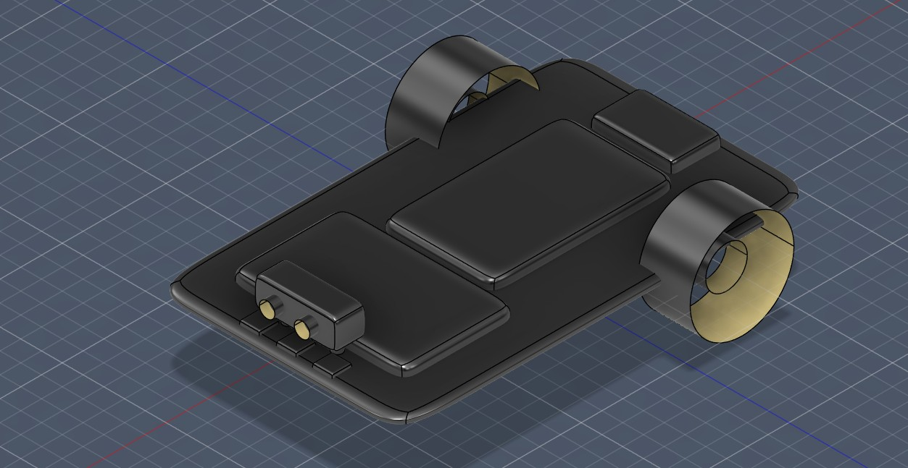
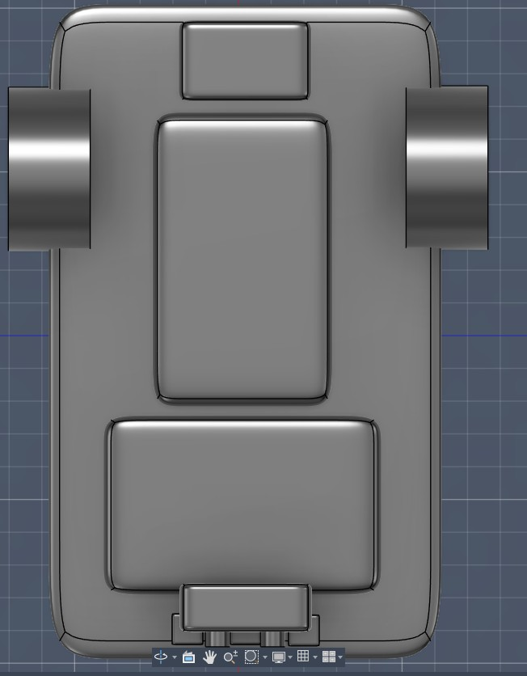
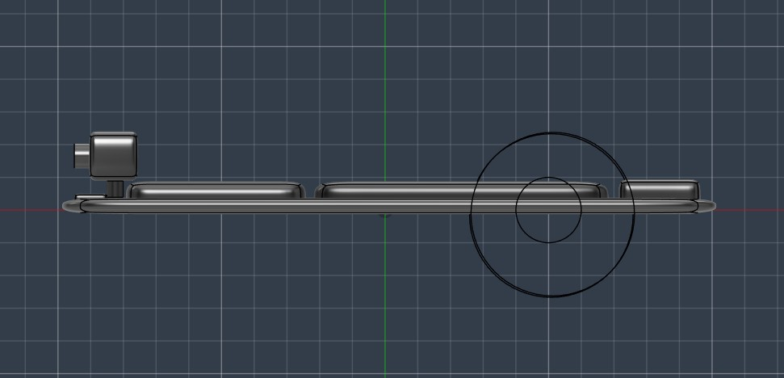
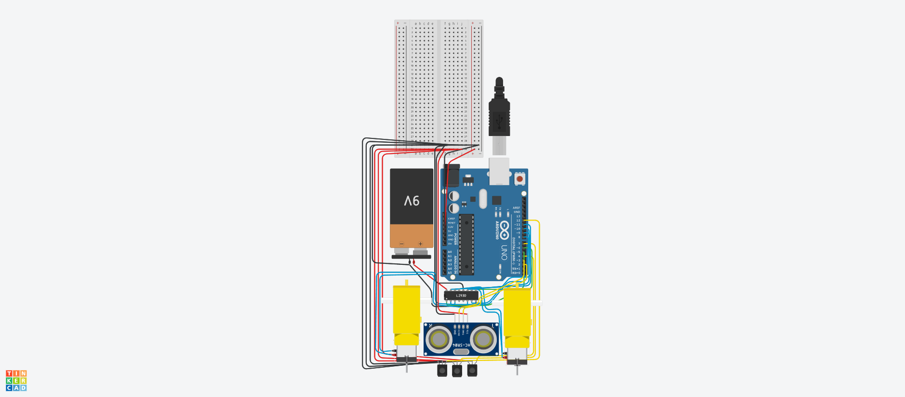

# Autonomous Line Following Robot with Obstacle Detection

## Description

This project is an autonomous robot that follows a line using IR sensors and avoids obstacles using an ultrasonic sensor. It uses an Arduino to process inputs and control motors via a motor driver.

## Why I Made This

I built this project to understand how sensors, motor drivers, and microcontrollers work together to create an autonomous system.

## CAD Model

A complete 3D CAD assembly of the robot was designed using Fusion 360. This includes the base, motors, sensors, and electronics layout.

### Files:

* `robot.step` → Universal CAD model (for viewing)
* `robot.f3d` → Source design file (editable in Fusion 360)

### Preview:

!

## Wiring & Circuit

## Wiring Explanation

* IR sensors connected to D12, D7, D4
* Ultrasonic sensor connected to D2 (Trig) and D3 (Echo)
* Motor driver connected to D8–D11
* Enable pins connected to D5 and D6
* Common ground used across all components

## Challenges Faced

- Initially connected motor driver incorrectly and debugged wiring while making base model
- Faced breadboard split issue (A–E vs F–J rows) 
- Ultrasonic sensor initially gave no readings due to wiring mistakes during simulation in TINKERCAD
- Fixed grounding issues by ensuring common ground across all components during Simulation in Tinkercad
- Had to learn how to use fusion360 to make cad files for projects.
  
## Code

See `code.ino`

## BOM

| Component          | Quantity |
| ------------------ | -------- |
| Arduino Uno        | 1        |
| L293D Motor Driver | 1        |
| DC Motor           | 2        |
| IR Sensor          | 3        |
| Ultrasonic Sensor  | 1        |
| Battery            | 1        |
| Breadboard         | 1        |
| Jumper Wires       | Multiple |

## Notes

This is a breadboard-based prototype. The CAD model represents the physical layout and placement of all components for future enclosure design.

##Picture of Base Model

